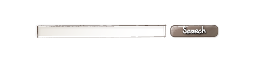

Создаём свой BEM-блок
=====================

Создавать мы будем блок поиска, состоящий из поля ввода и кнопки, по нажатию на которую будет осуществляться поиск.



Структура
---------

Прежде, чем приступать к написанию `html` и `сss`, стоит подумать о структуре блока.

Наш блок содержит два элемента: поле ввода и кнопку. Сам блок мы назовём `search`, а элементы — `input` и `button`.

Составим схему элемента в формате `json`:

```json
{
    "block": "search",
    "content": [
        { "elem": "input" },
        { "elem": "button" }
    ]
}
```

Разметка
--------

Согласно [схеме именования](https://ru.bem.info/method/definitions/#Пример-схемы-именования-независимых-css-классов), `html`-разметка нашего блока могла бы выглядеть примерно так:

```hmtl
<div class="search">
    <input type="search__text" class="input">
    <button class="search__button"></button>
</div>
```

Чтобы упростить себе задачу (в частности, не прописывать длинные названия классов вручную), мы воспользуемся возможностями шаблонизатора — инструмента, превращающего структуру блока в `html`-разметку.

Для этого возьмём структуру блока, которую мы составили ранее, и обернём её в следующий JavaScript-код:

```js
BEM.DOM.append("body", BEM.HTML.apply({
    "block": "search",
    "content": [
        { "elem": "input" },
        { "elem": "button" }
    ]
}));
```

Метод `BEM.HTML.apply` преобразует `json` (формат, в котором описана структура блока) в `html`, а метод `BEM.DOM.append` вставляет этот `html` внутрь тэга `body`.

Чтобы этот код заработал, его нужно вставить в файл `app.js` внутрь конструкции `BEM( ... );`.

Содержимое файла к этому моменту выглядит так:

```js
BEM(
    BEM.DOM.append("body", BEM.HTML.apply({
        "block": "search",
        "content": [
            { "elem": "input" },
            { "elem": "button" }
        ]
    }));
);
```

Если мы откроем в браузере файл `index.html`, то ничего не увидим. В чём же дело?

Просто шаблонизатор по умолчанию преобразует блок и его элементы в тэги `div`.

Укажем, какие именно тэги следует использовать для элементов `input` и `button`. Для этого укажем их в структуре элементов:

```js
BEM(
    BEM.DOM.append("body", BEM.HTML.apply({
        "block": "search",
        "content": [
            {
                "elem": "input",
                "tag": "input"
            },
            {
                "elem": "button",
                "tag": "button"
            }
        ]
    }));
);
```

Однако, наш блок нельзя назвать завершённым: полю ввода и кнопке на хватает надписей.

Для поля ввода зададим атрибут `placeholder`:

```js
{
    "elem": "input",
    "tag": "input",
    "attrs" { "placeholder": "Введите текст поиска" }
}
```

Для кнопки заполним содержимое тэга:

```js
{
    "elem": "button",
    "tag": "button",
    "content": "Искать!"
}
```

Файл `app.js` должен выглядеть примерно так:

```js
BEM(
    BEM.DOM.append("body", BEM.HTML.apply({
        "block": "search",
        "content": [
            {
                "elem": "input",
                "tag": "input",
                "attrs" { "placeholder": "Введите текст поиска" }
            },
            {
                "elem": "button",
                "tag": "button",
                "content": "Искать!"
            }
        ]
    }));
);
```

Использование готовых блоков
----------------------------

Мы потренировались в создании собственных блоков. Теперь самое время посмотреть, можем ли мы воспользоваться набором готовых — библиотечных — блоков.

В [списке блоков](https://ru.bem.info/libs/bem-components/v2.1.0/#Блоки) есть блоки `input` и `button` — попробуем использовать их вместо наших элементов.

На странице блока `input` находим первый пример, нажимаем на вкладку `bemjson` и копируем его структуру:

```json
{
    "block": "input",
    "mods": { "theme": "islands", "size": "m" },
    "placeholder": "Введите имя"
}
```

Заменим структуру элемента 'input' на структуру блока:

```json
{
    "block": "search",
    "content": [
        {
            "block": "input",
            "mods": { "theme": "islands", "size": "m" },
            "placeholder": "Введите текст поиска"
        },
        { "elem": "button" }
    ]
}
```

Аналогичным образом заменим элемент `button` на библиотечный блок.

Теперь можно удалить шаблоны элементов — они больше не нужны.

Файл `app.js` теперь выглядит так:

```js
BEM(
    BEM.DOM.append("body", BEM.HTML.apply({
        "block": "search",
        "content": [
            {
                "block": "input",
                "mods": { "theme": "islands", "size": "m" },
                "placeholder": "Введите текст поиска"
            },
            {
                "block": "button",
                "mods": { "theme": "islands", "size": "m" },
                "text": "Искать!"
            }
        ]
    }));
);
```

Стили
=====

Чтобы задать визуальное оформление для нашего блока, в файле `app.css` создадим одноимённый селектор:

```css
.search {
    margin: 20px auto;
}
```

Чтобы задать стили для вложенных блоков, воспользуемся каскадами:

```css
.search > .button {
    margin-left: 10px;
}
```

Важно помнить, что каскады, хотя и допустимы в методологии БЭМ, усложняют вёрстку, поэтому должны использоваться с осторожностью.

Поведение
=========

Сделаем так, чтобы кнопка была активна только в том случае, если введён поисковый запрос.

Для начала создадим JavaScript-представление блока `search`. Для этого добавим в файл `app.js` код:

```js
BEM.DOM.decl('search', {
    onSetMod: {
        js: function () {
            // код, расположенный здесь, будет
            // выполнятся при создании блока
        }
    }
});
```

Воспользуемся методом `getBlockInside`, чтобы получить доступ ко вложенным блокам:

```js
BEM.DOM.decl('search', {
    onSetMod: {
        js: function () {
            var input = this.findBlockInside('input');
            var button = this.findBlockInside('button');
        }
    }
});
```

Для того, чтобы определить, введён поисковый запрос или нет, мы будем слушать событие `change` блока `input`:

```js
input.on('change', function () {
    if (input.val() === '') {
        // если поисковый запрос не введён
    } else {
        // если поисковый запрос введён
    }    
});
```

Полный список доступных событий блока указан на его странице в документации.

Чтобы сделать кнопку неактивной, мы будем устанавливать её модификатор `disabled`:

```js
input.on('change', function () {
    if (input.val() === '') {
        button.setMod('disabled'); // устанавливаем модификатор
    } else {
        button.delMod('disabled'); // удаляем модификатор
    }    
});
```

Не будем забывать, что кнопка должна быть заблокирована при создании блока, пока ни одно событие `change` ещё не было вызвано.

Для этого добавим модификатор `disabled` в структуру блока `button`.

Итоговый вид файла `app.js`:

```js
BEM(
    BEM.DOM.decl('search', {
        onSetMod: {
            js: function () {
                var input = this.findBlockInside('input');
                var button = this.findBlockInside('button');

                input.on('change', function () {
                    if (input.val() === '') {
                        button.setMod('disabled');
                    } else {
                        button.delMod('disabled');
                    }    
                });
            }
        }
    });

    BEM.DOM.append("body", BEM.HTML.apply({
        "block": "search",
        "content": [
            {
                "block": "input",
                "mods": { "theme": "islands", "size": "m" },
                "placeholder": "Введите текст поиска"
            },
            {
                "block": "button",
                "mods": { "theme": "islands", "size": "m", disabled: true },
                "text": "Искать!"
            }
        ]
    }));
);
```
